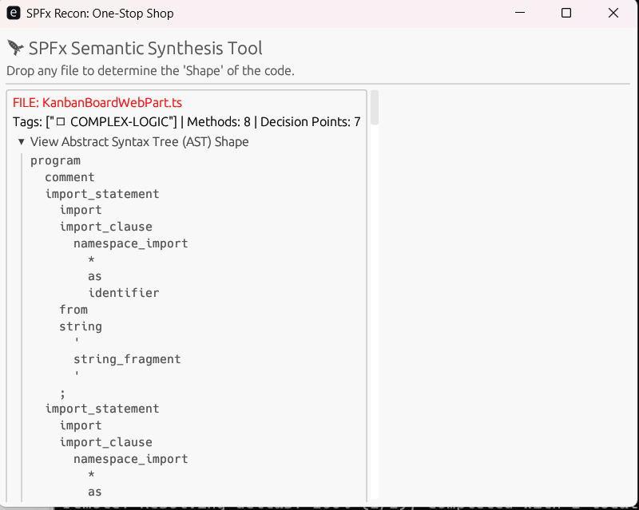

# SPFx Recon: Semantic Synthesis Engine


\*\*SPFx Recon\*\* is a systems-level static analysis tool designed to perform deep semantic reviews of SharePoint Framework (SPFx) components. By leveraging `tree-sitter` for high-fidelity parsing, it identifies architectural patterns and security risks that traditional regex-based scanners miss.


## 🚀 Core Capabilities


\- \*\*AST-Based Traversal:\*\* Navigates the Abstract Syntax Tree to identify true code structures rather than simple string matches.

\- \*\*Risk Scoring:\*\* Automatically flags DOM manipulation (`innerHTML`, `document.`) and unauthorized API access patterns.

\- \*\*Complexity Mapping:\*\* Evaluates cognitive load by analyzing decision-point density (if-statements) and method counts.

\- \*\*Modern UI:\*\* A hardware-accelerated dashboard built with `egui` for real-time analysis feedback.


## 🛠 Technology Stack


\- \*\*Engine:\*\* Rust (Memory-safe, high-concurrency performance)

\- \*\*Parser:\*\* `tree-sitter-typescript` (Grammar-based incremental parsing)

\- \*\*GUI:\*\* `eframe` / `egui` (Immediate-mode rendering)


## 📖 Usage


1\. \*\*Build the tool:\*\*

&nbsp;  ```bash

&nbsp;  cargo build --release


## 🔍 Interface & AST Analysis

### Application Dashboard


### Semantic Deep Dive
This view shows the `tree-sitter` parser identifying specific TypeScript nodes like `import_statement` and `namespace_import`.



